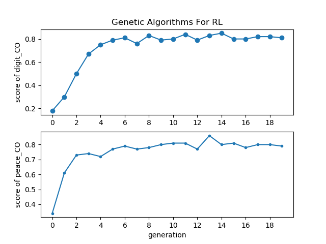
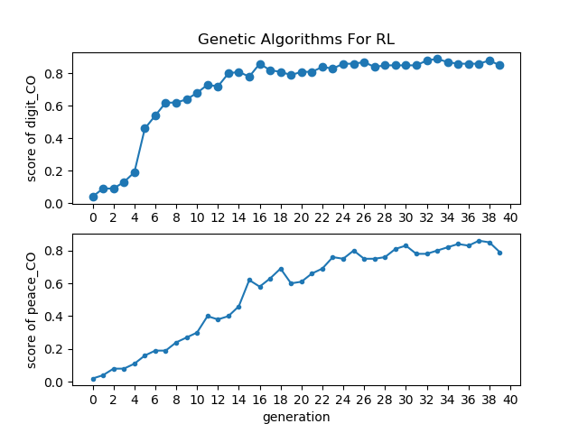

# Genetic Algorithm For RL Problems
 Genetic Algorithms for RL problem in gym environment
 
 Research In Digital Systems Course Material
 
 Supervisor : Dr.Öğr.Üy. İSMAİL SAN
 
 
 
 ## Code benefit from :  
 
 [openai genetic algorithm on FrozenLake-v0](https://gym.openai.com/evaluations/eval_4VyQBhXMRLmG9y9MQA5ePA/)
 
 [metaheuristics-comparison](https://github.com/kivancguckiran/metaheuristics-comparison/blob/master/genetic/project.py)
 
 ## RESULTS :
 Environment : FrozenLake4x4-v0
 
 
 Environment : FrozenLake8x8-v0
 
